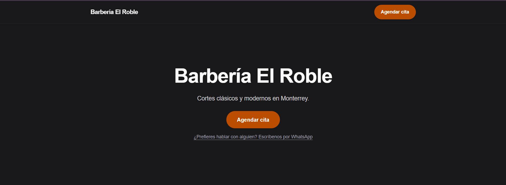
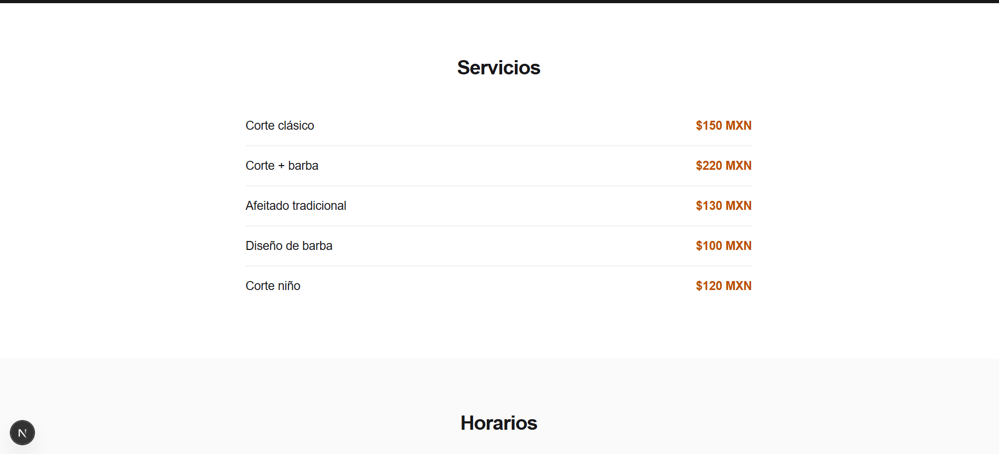
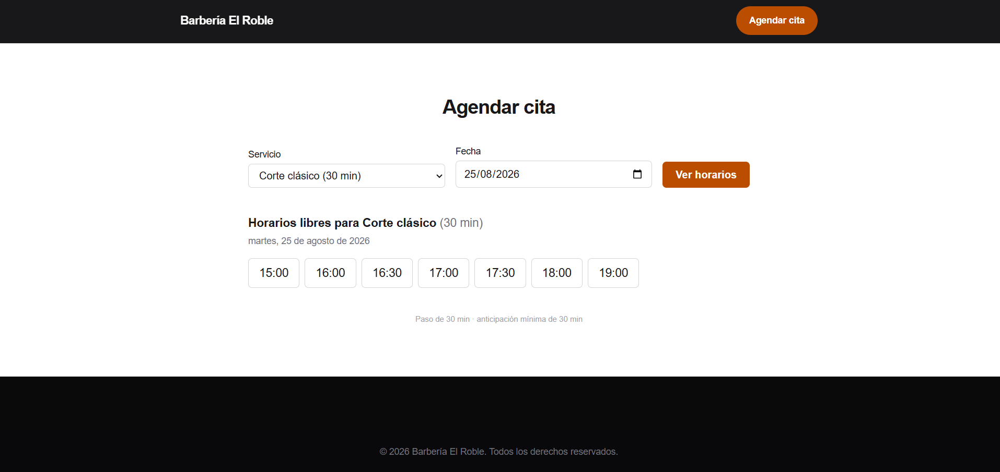
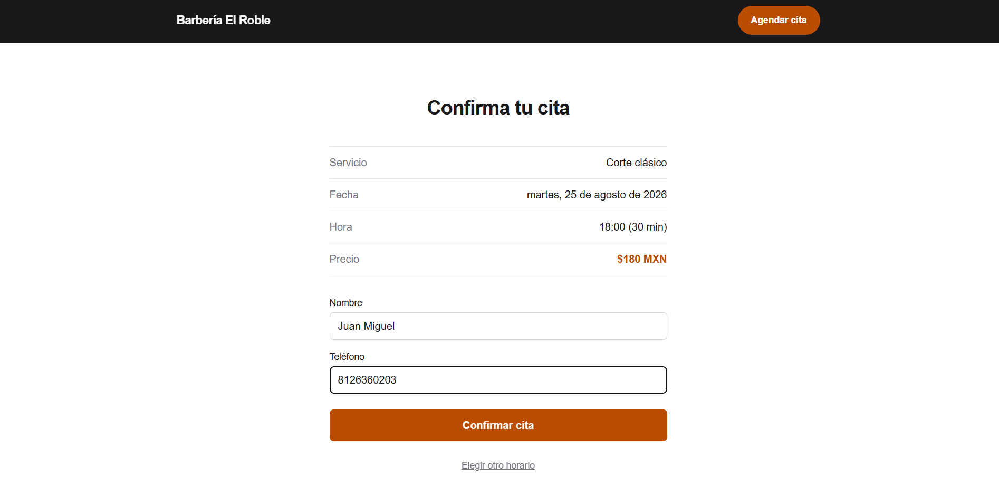
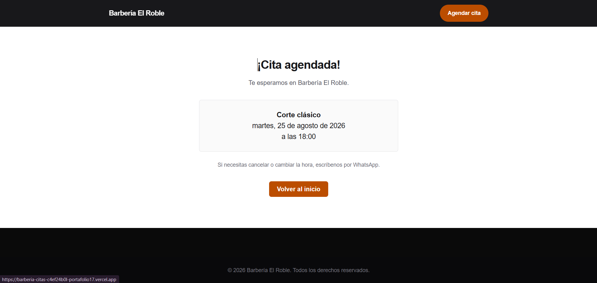

# Barbería El Roble — Sitio web y sistema de citas

Sitio web para barberías y negocios locales que hoy agendan por WhatsApp
o libreta, y pierden citas por no tener dónde reservar.

**Demo:** https://barberia-citas-one.vercel.app/

## El sitio



Los servicios y precios se leen desde la base de datos, así que el dueño
los edita sin tocar código.



---

## Cómo se agenda una cita

**1 · Elegir servicio y ver horarios reales**

Solo aparecen las horas realmente libres: se descartan las ocupadas, las
que ya pasaron, y las que no alcanzan a cubrir la duración del servicio
antes del cierre.



**2 · Confirmar antes de dar los datos**

El cliente ve exactamente qué está reservando —servicio, fecha, hora y
precio— antes de escribir su nombre.



**3 · Cita agendada**

La cita queda guardada con protección contra empalmes a nivel de base de
datos: dos personas no pueden reservar el mismo horario, ni aunque lo
intenten en el mismo instante.



## El problema

Un negocio local sin presencia web depende de que lo encuentren en la calle.
Sin agenda digital, el dueño atiende el teléfono mientras corta el cabello,
y las citas se anotan en papel.

## Solución

- Presencia web propia, rápida y adaptada a móvil
- Catálogo de servicios con precios visibles
- Reserva de citas en línea (en desarrollo)
- Panel para que el dueño administre su agenda (en desarrollo)

## Stack

- Next.js (App Router) + TypeScript
- Tailwind CSS
- Supabase — Postgres + Auth (en desarrollo)
- Desplegado en Vercel

## Correr en local

```bash
git clone https://github.com/DiegoE6/barberia-citas.git
cd barberia-citas
npm install
npm run dev
```

Abrir http://localhost:3000

## Estado del proyecto

- [x] Fase 1 — Landing pública
- [x] Fase 2 — Base de datos
- [x] Fase 3 — Reserva de citas
- [ ] Fase 4 — Panel de administración

Ver [docs/PLAN.md](docs/PLAN.md) para el detalle.